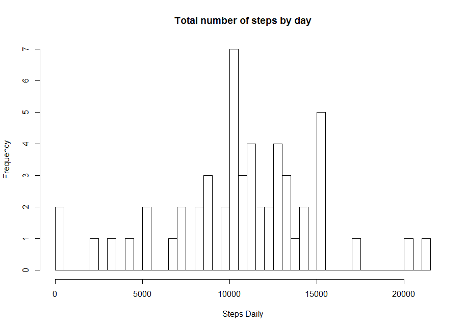
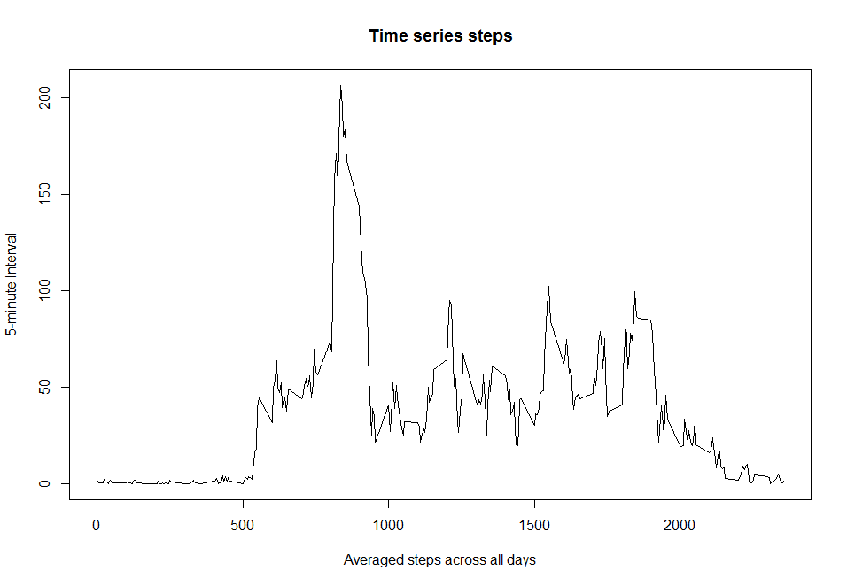
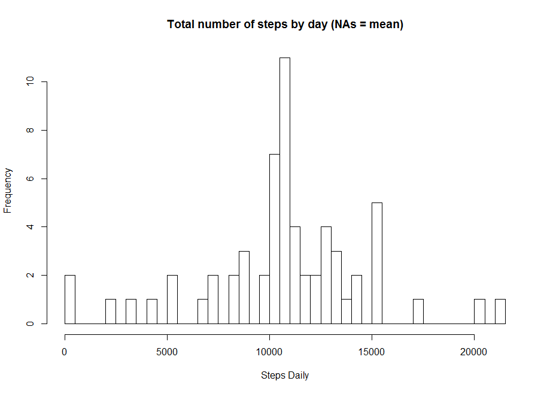
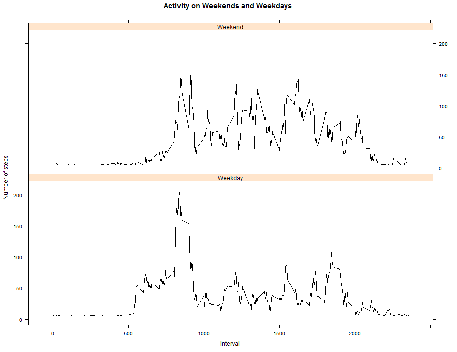

Loading and preprocessing the data


```r
data <- read.csv(unz("activity.zip", "activity.csv"), header=TRUE)

###Convert to Date
data$date <- as.Date(data$date) 
```

What is mean total number of steps taken per day?

```r
no.NA <- na.omit(data)

sum.steps <- aggregate(data$steps, by=list(date=data$date), FUN=sum)
sum.steps <- na.omit(sum.steps)
```


```r
hist(sum.steps$x, breaks = 60, main = "Total number of steps by day", xlab = "Steps Daily")
```

 


```r
###Steps mean by day
mean(sum.steps$x)
```

```
## [1] 10766.19
```


```r
###Steps median by day
median(sum.steps$x)
```

```
## [1] 10765
```

What is the average daily activity pattern?


```r
library(plyr)
steps.5min <- ddply(no.NA,~interval, summarise, mean=mean(steps))
```


```r
plot(steps.5min$interval, steps.5min$mean, xlab="Averaged steps across all days", ylab= "5-minute Interval", main="Time series steps", type="l")
```

 


```r
### Interval that contain the maximum number of steps
steps.5min[which.max(steps.5min$mean), ]
```

```
##     interval     mean
## 104      835 206.1698
```

Imputing missing values


```r
###Calculate and report the total number of missing values in the dataset (i.e. the total number of rows with NAs)

###Total NAs in steps column - date and interval are factors, don't have missiong values
sum(is.na(data$steps))
```

```
## [1] 2304
```


```r
###Devise a strategy for filling in all of the missing values in the dataset. The strategy does not need to be sophisticated. For example, you could use the mean/median for that day, or the mean for that 5-minute interval, etc.

na.position <- which(is.na(data$steps))

mean.vector <- rep(mean(data$steps, na.rm=TRUE), times=length(na.position))
```


```r
###Create a new dataset that is equal to the original dataset but with the missing data filled in.

#Replace NA by the mean
data[na.position, "steps"] <- mean.vector

head(data)
```

```
##     steps       date interval
## 1 37.3826 2012-10-01        0
## 2 37.3826 2012-10-01        5
## 3 37.3826 2012-10-01       10
## 4 37.3826 2012-10-01       15
## 5 37.3826 2012-10-01       20
## 6 37.3826 2012-10-01       25
```


```r
###Make a histogram of the total number of steps taken each day and calculate and report the mean and median total number of steps taken per day. Do these values differ from the estimates from the first part of the assignment? What is the impact of imputing missing data on the estimates of the total daily number of steps?

sum.steps2 <- aggregate(data$steps, by=list(date=data$date), FUN=sum)
```


```r
hist(sum.steps2$x, breaks = 60, main = "Total number of steps by day (NAs = mean)", xlab = "Steps Daily")
```

 


```r
###Steps mean by day
mean(sum.steps2$x)
```

```
## [1] 10766.19
```


```r
median(sum.steps2$x)
```

```
## [1] 10766.19
```

Are there differences in activity patterns between weekdays and weekends?


```r
###Create a new factor

weekdays <- weekdays(data$date)
data$weekdays <- ifelse(weekdays == "domingo" | weekdays == "sábado", "Weekend", "Weekday")

steps.week <- aggregate(data$steps, by = list(data$interval, data$weekdays), mean)

names(steps.week) <- c("interval", "weekdays", "steps")
```


```r
library(lattice)
xyplot(steps ~ interval | weekdays, steps.week, type = "l", layout = c(1, 
    2), xlab = "Interval", ylab = "Number of steps", main = "Activity on Weekends and Weekdays", 
    col = "black")
```

 
